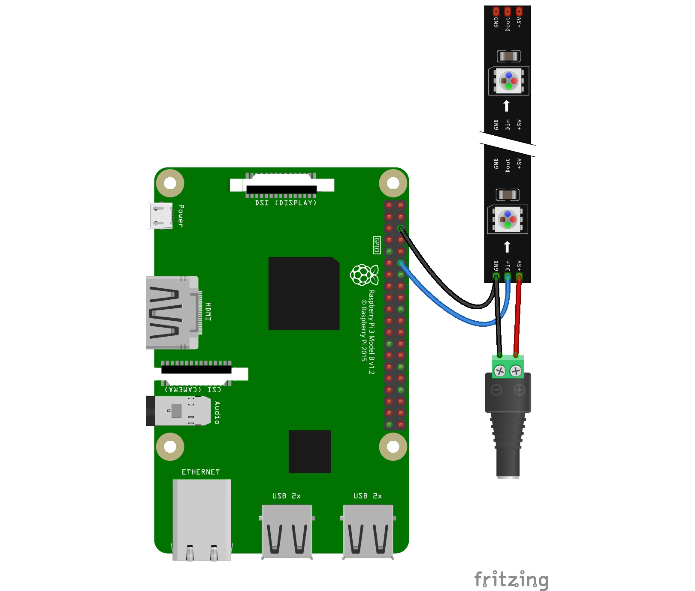

# tdLEDpi
Art-net LED interface using Raspberry and Touchdesigner

## Whats Needed
	* Raspberry Pi 1-3+ wired to network with Ethernet
	* NeopixeL Led strip
	* 5v power for the neopixels


1. Install Raspbian Lite Latest version and Setup SSH
	* https://hackernoon.com/raspberry-pi-headless-install-462ccabd75d0
    
2. Change Password with 
```
passwd
```

3. Install Vim and Fish
```
sudo apt-get install -y vim fish
chsh -s /usr/bin/fish
echo /usr/bin/fish | sudo tee -a /etc/shells
```

4. Change Hostname
	* Change `raspberrypi` to unique hostname in /etc/hostname and /etc/hosts
```
sudo vim /etc/hostname
sudo vim /etc/hosts
```

5. Expand Filesys
```
sudo raspi-config
```
	* Advanced > Expand FS

6. Update
	* Main Menu > Update
```
sudo reboot
```

7. Install pip
```
sudo apt-get install -y python3-pip
```

8. Install need Python Libs
```
sudo pip3 install rpi_ws281x adafruit-circuitpython-neopixel
			or
sudo python3 -m pip install --force-reinstall adafruit-blinka
```

9. Install ola
```
sudo apt-get install -y ola
```

10. Install node/npm
```
curl -sL https://deb.nodesource.com/setup_10.x | sudo -E bash -
sudo apt install nodejs
```
    
11. Install OPC
```
npm install node-opc-server
cd node_modules/node-opc-server/opc-server
npm install
sudo node index.js
```

12. Modify ola Configs
	* Add last 2 lines to /etc/ola/ola-openpixelcontrol.conf
```
enabled = true
target = 127.0.0.1:7890
target_127.0.0.1:7890_channel = 0
```
	
13. Browse to OLA
	* Reload config
	* Add universe
	* Input = Artnet
	* Output = Open Pixel Control
    

14. Wire the pi to LED


15. Config TD
	* Open provided TOE
	* In the DMXout Chop at select universe 1 and add RPi IP address to Network address field
	
## Known Issues
- I havent been able to get this to work with the Raspberry Pi 4 yet. For whatever reason it causes a kernel panic at step number 11 when starting the node.js server and requires a hard reboot to run any commands.


